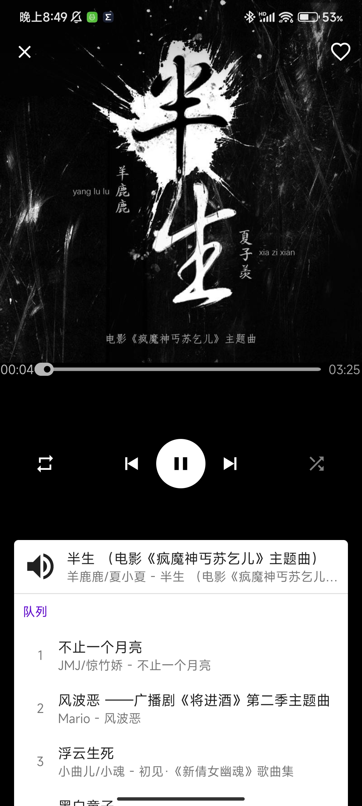

# Projekt Cloud Piece MusicPlayer

## Package Name
`projekt.cloud.piece.music.player`

[](https://github.com/1552980358/MusicPlayer/actions)

## Screenshots
Main             |  Play
:-------------------------:|:-------------------------:
 | 

## Supported API
- Android L - 5.0 (API 21)
- Android L_MR1 - 5.1 (API 22)
- Android M - 6.0 (API 23)
- Android N - 7.0 (API 24)
- Android N_MR1 - 7.1 (API 25)
- Android O - 8.0 (API 26)
- Android O_MR1 - 8.1 (API 27)
- Android P - 9.0 (API 28)
- Android Q - 10.0 (API 29)
    - `Update SystemUtil.kt: Update Activity.pixelHeight`
        - Commit: [fd02e36](https://github.com/1552980358/MusicPlayer/commit/fd02e36df7813b745babeafaa427f3cc90b4e170)
- Android R - 11.0 (API 30)
    - `SystemUtil.kt: Update deprecated method`
        - Commit: [6e5e1e8](https://github.com/1552980358/MusicPlayer/commit/6e5e1e86a643c1be2a5d002d4c6b900b97baf23c)
        - Google Document Source: [getSize](https://developer.android.com/reference/android/view/Display#getSize(android.graphics.Point))
- Android S - 12.0 (API 31)
    - `NotificationUtil.kt: Fix "Warning: Missing PendingIntent mutability flag" on Android 12`
        - Commit: [298b132](https://github.com/1552980358/MusicPlayer/commit/298b132064cbcb492ed818fb286a21de531366af)
        - Google Document Source: [Pending intents mutability](https://developer.android.com/about/versions/12/behavior-changes-12#pending-intent-mutability)
    - Safer component exporting
        - `If your app targets Android 12 or higher and contains activities, services, or broadcast receivers that use intent filters, you must explicitly declare the android:exported attribute for these app components.`
        - `AndroidManifest.xml: Implement WebService`
            - Commit: [3ec15b9](https://github.com/1552980358/MusicPlayer/commit/3ec15b932f6f872be5d29f9fac9e96b251d3c1fd#diff-7fa6aef292187a049f7a4d6060d8df3ba212d838789c78940bd363344b1c38cd)
        - `Update and implement android build gradle into 7.0.0`
            - Commit: [f1e7bbc](https://github.com/1552980358/MusicPlayer/commit/f1e7bbce27b9c2eba5096493fa3d0883aa1673df#diff-7fa6aef292187a049f7a4d6060d8df3ba212d838789c78940bd363344b1c38cd)
        - Google Document Source: [Safer component exporting](https://developer.android.com/about/versions/12/behavior-changes-12#exported)
    - `Add support Android 12.0 SplashScreen`
        - Commit: [9096b6c](https://github.com/1552980358/MusicPlayer/commit/9096b6c2220c422703cc90a96db8bb49208690b2)
        - Google Document Source: [Splash screens](https://developer.android.com/guide/topics/ui/splash-screen)
- Android SL/Sv2 (API 32) [Beta]

## Lyric format
- Time statement before lyric text
- One line per one line of lyric
- Format: `[mm:ss.ss]Lyric text`
- For example:
  ```
  [00:00.50]First lyric text
  [00:01.10]Second lyric text
  ```
  
## Known Issue
- No animation on navigateUp from `AudioListFragment` to `MainFragment`.`AlbumFragment`
  - Question on StackOverflow
    - [Container transform navigate up animation problem of RecyclerView in Fragment inside ViewPager2](https://stackoverflow.com/questions/71522617/container-transform-navigate-up-animation-problem-of-recyclerview-in-fragment-in)
  - Issue on GitHub Material Repo `material-components/material-components-android`
    - [#2606 Container transform navigate up animation problem of RecyclerView in Fragment inside ViewPager2](https://github.com/material-components/material-components-android/issues/2606)
  - Affected classes
    - [AudioListFragment.kt](app/src/main/java/projekt/cloud/piece/music/player/ui/audioList/AudioListFragment.kt)
    - [AlbumFragment.kt](app/src/main/java/projekt/cloud/piece/music/player/ui/main/album/AlbumFragment.kt)
    - [MainFragment.kt](app/src/main/java/projekt/cloud/piece/music/player/ui/main/MainFragment.kt)
  - Affected commits
    - `AlbumFragment.kt: Update page showing list of albums` [#89ff3b7](https://github.com/1552980358/MusicPlayer/commit/89ff3b75bfc265f9b594f477e16b6c907b52293a)
    - `AudioListFragment.kt: Update and implement fragment showing related audio list` [#e3e9ac5](https://github.com/1552980358/MusicPlayer/commit/e3e9ac56f60f0ebcd820c094f6dfbff413f7c067)

## Required Permission
- `android.permission.FOREGROUND_SERVICE`
- `android.permission.READ_EXTERNAL_STORAGE`
- `android.permission.WAKE_LOCK`
- `android.permission.INTERNET`
- `android.permission.ACCESS_WIFI_STATE`
- `android.permission.MODIFY_AUDIO_SETTINGS`
- `android.permission.BLUETOOTH_CONNECT`
- `android.permission.MODIFY_AUDIO_SETTINGS`
- `android.permission.RECORD_AUDIO`
- `android.permission.REQUEST_IGNORE_BATTERY_OPTIMIZATIONS`
- Permission list can be found at [AndroidManifest.xml](app/src/main/AndroidManifest.xml)

## Dependencies
- `org.jetbrains.kotlin:kotlin-stdlib`
- `org.jetbrains.kotlinx:kotlinx-coroutines-core`
- `org.jetbrains.kotlinx:kotlinx-coroutines-android`
- `androidx.core:core-ktx`
- `androidx.core:core-splashscreen`
- `androidx.appcompat:appcompat`
- `androidx.constraintlayout:constraintlayout`
- `androidx.navigation:navigation-fragment-ktx`
- `androidx.navigation:navigation-ui-ktx`
- `androidx.lifecycle:lifecycle-livedata-ktx`
- `androidx.lifecycle:lifecycle-viewmodel-ktx`
- `androidx.media:media`
- `androidx.swiperefreshlayout:swiperefreshlayout`
- `androidx.preference:preference-ktx`
- `androidx.databinding:databinding-compiler-common`
- `androidx.room:room-runtime`
- `androidx.room:room-compiler`
- `androidx.palette:palette-ktx`
- `androidx.viewpager:viewpager`
- `com.google.android.material:material`
- `com.google.android.exoplayer:exoplayer-core`
- `com.google.android.exoplayer:exoplayer-hls`
- `com.google.code.gson:gson`
- `com.github.android:renderscript-intrinsics-replacement-toolkit`
- `com.github.1552980358:KtExtension`
- `com.github.1552980358:KtExtensionAndroid`
- `com.github.1552980358:C2Pinyin`
- `com.github.mkaflowski:Media-Style-Palette`
- `org.nanohttpd:nanohttpd `
- `org.nanohttpd:nanohttpd-websocket`
- `com.github.thegrizzlylabs:sardine-android`
- Dependencies detail can be found at [project:build.gradle.kts](build.gradle.kts) and [app:build.gradle.kts](app/build.gradle.kts)

## Maintenance Language
- Kotlin

## IDE
- Intellij Idea
- Android Studio

## Open-source License - [GNU GENERAL PUBLIC LICENSE Version 3](LICENSE)
```
Projekt Cloud Piece, including all git submodules are free software:
you can redistribute it and/or modify it under the terms of the
GNU General Public License as published by the Free Software Foundation,
either version 3 of the License, or (at your option) any later version.

This program is distributed in the hope that it will be useful,
but WITHOUT ANY WARRANTY; without even the implied warranty of
MERCHANTABILITY or FITNESS FOR A PARTICULAR PURPOSE.  See the
GNU General Public License for more details.

You should have received a copy of the GNU General Public License
along with this program.  If not, see <http://www.gnu.org/licenses/>.
```